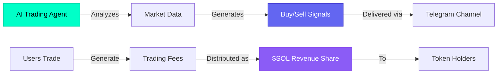
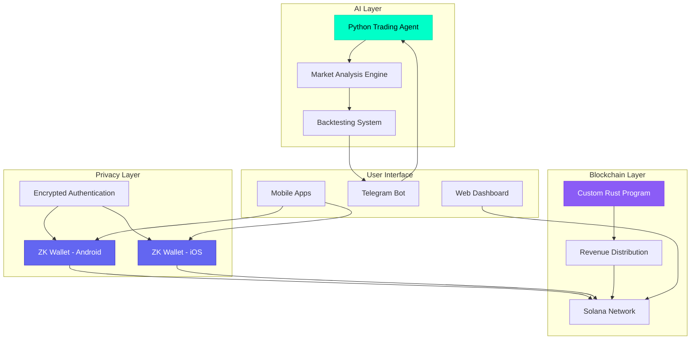
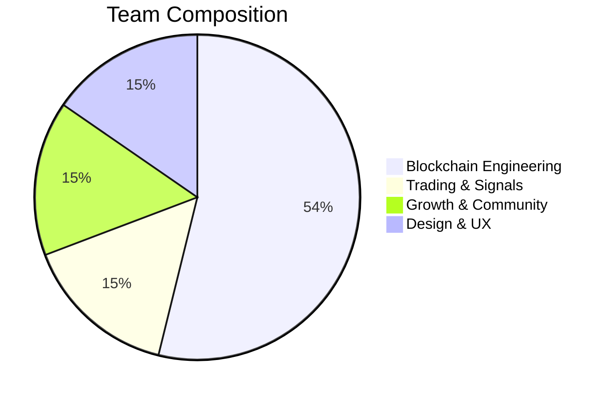

# ⚡ PulseMaker

**AI-Powered Trading Intelligence on Solana**

PulseMaker is a live, AI-driven trading ecosystem built on Solana, designed to deliver real signals, real privacy (ZK), and real earnings — without empty promises.

**No hype narratives. Only systems that work.**

[](https://x.com/pulsemakersol)
[](https://t.me/PulseMaker)
[](https://github.com/pulsemaker)

---

## 🚀 What is PulseMaker?

PulseMaker combines **AI Agents**, **on-chain execution**, and **privacy-first infrastructure** to give traders an unfair advantage — while sharing real revenue back to the community in **$SOL**.



---

## 🧠 Core Products

### ⚡ AI Buy & Sell Signals

Real-time trading signals powered by artificial intelligence.

- **AI Trading Agents**: Signals generated by advanced AI models
- **Real-time Market Interpretation**: Instant analysis of market movements
- **Backtested Performance**: Validated strategies with proven win rates
- **Telegram Channel Delivery**: Direct signal delivery to subscribers
- **No Manual Noise**: Automated, bias-free decision making

**Technology**: Python-based AI agent with comprehensive backtesting framework

---

### 🔐 ZK Wallet (Android & iOS)

Privacy-first cryptocurrency wallet with zero-knowledge technology.

- **Zero-Knowledge Privacy**: Advanced ZK cryptography for maximum privacy
- **Encrypted Login**: Secure identity protection
- **Non-Custodial**: You control your keys and assets
- **Cross-Platform**: Native Android and iOS applications
- **Seamless UX**: Intuitive mobile experience

**Features**: End-to-end encrypted, user-controlled, privacy by default

---

### 💸 Instant Revenue Share in $SOL

Passive income from trading activity, distributed transparently on-chain.

- **Instant Distribution**: Real-time revenue sharing to token holders
- **$SOL Payments**: Direct Solana distribution
- **On-Chain Transparency**: Fully auditable and verifiable
- **Activity-Based**: Revenue from actual platform usage
- **No Lockups**: Access rewards immediately

**Technology**: Custom Rust program on Solana for claims and reward distribution

---

## 🏗️ Architecture



---

## ⚙️ Why PulseMaker?

| Feature | Benefit |
|---------|---------|
| **Built on Solana** | Ultra-fast execution and low transaction costs |
| **Designed for Serious Users** | No hype, only functional tools |
| **Privacy by Default** | ZK technology protects user identity |
| **Revenue from Usage** | Earnings based on real activity, not promises |
| **AI-Driven** | Remove emotion from trading decisions |
| **On-Chain Transparency** | Verifiable and auditable operations |

---

## 🧩 Ecosystem Principles

- ✅ **AI over emotion** — Data-driven decisions, not FOMO
- ✅ **Privacy by default** — Zero-knowledge infrastructure
- ✅ **On-chain transparency** — Fully auditable operations
- ✅ **Community-aligned incentives** — Revenue sharing with holders

---

## 🔑 The Pulser Mindset

> Most projects sell dreams.  
> **PulseMaker delivers tools.**
>
> Use your mind.  
> Trade smart.  
> Earn with confidence.

---

## 👥 Team

PulseMaker is built by a **cross-disciplinary team** combining deep blockchain engineering, trading expertise, privacy technology, and growth leadership.



### ⚙️ Core Engineering

| Role | Experience | Count |
|------|-----------|-------|
| **Solana Rust Developers** | 2+ years Solana, 7+ years blockchain | 3 |
| **Crypto Wallet Developers** | 4+ years wallet architecture & security | 2+ |
| **Zero-Knowledge (ZK) Developer** | 3+ years privacy & ZK systems | 1 |

### 📊 Trading & Signal Expertise

| Role | Experience | Count |
|------|-----------|-------|
| **Trading Indicator Creators** | 11+ years professional trading | 2 |
| | Market structure, momentum & signal logic | |

### 📣 Growth & Community

| Role | Experience | Count |
|------|-----------|-------|
| **KOL Leaders** | Network of 110+ active KOLs | 2 |
| | Community growth & market reach | |

### 🎨 Design & UX

| Role | Experience | Count |
|------|-----------|-------|
| **Design Experts** | 5+ years product, UI/UX & brand design | 2 |

**Built by specialists. Designed for serious users.** ✅

---

## 🛠️ Technology Stack

### Frontend
- **React** — Modern UI framework
- **Vite** — Fast build tooling
- **TailwindCSS** — Utility-first styling
- **Framer Motion** — Smooth animations
- **React Router** — Client-side routing

### Blockchain
- **Solana** — High-performance blockchain
- **Rust** — Smart contract development
- **@solana/web3.js** — Solana integration
- **Wallet Adapters** — Multi-wallet support

### AI & Signals
- **Python** — AI agent development
- **Backtesting Framework** — Strategy validation
- **Telegram API** — Signal delivery

### Mobile
- **React Native / Native Development** — iOS & Android apps
- **Zero-Knowledge Cryptography** — Privacy features

---

## 🚀 Getting Started

### Prerequisites
- Node.js 18+
- npm or yarn

### Installation

```bash
# Clone the repository
git clone https://github.com/pulsemaker/PulseMaker-Webside.git
cd PulseMaker-Webside

# Install dependencies
npm install

# Start development server
npm run dev

# Build for production
npm run build

# Preview production build
npm run preview
```

### Environment Variables

Create a `.env` file in the root directory:

```env
VITE_SOLANA_RPC_URL=your_rpc_url
VITE_TELEGRAM_BOT_TOKEN=your_telegram_bot_token
```

---

## 📁 Project Structure

```
PulseMaker-Webside/
├── src/
│   ├── components/      # Reusable UI components
│   │   ├── sections/    # Page sections (Hero, Features, etc.)
│   │   └── ui/          # Base UI components (Button, Logo, etc.)
│   ├── pages/           # Page components (Docs, etc.)
│   ├── context/         # React context providers
│   ├── assets/          # Static assets
│   ├── App.jsx          # Main app component
│   ├── main.jsx         # Entry point
│   └── index.css        # Global styles
├── public/              # Public assets
├── index.html           # HTML template
└── package.json         # Dependencies
```

---

## 🔗 Links

- **Website**: [https://pulsemaker.io](https://pulsemaker.io)
- **Twitter**: [@pulsemakersol](https://x.com/pulsemakersol)
- **Telegram**: [t.me/PulseMaker](https://t.me/PulseMaker)
- **GitHub**: [github.com/pulsemaker](https://github.com/pulsemaker)

---

## 📜 License

This project is proprietary. All rights reserved.

---

## ⚠️ Risk Disclaimer

Trading cryptocurrency involves substantial risk and may result in the loss of your invested capital. PulseMaker provides analytical tools and signals for **informational purposes only**. Nothing on this site constitutes financial advice. Past performance is not indicative of future results. **Trade responsibly** and only with funds you can afford to lose.

---

## ⚡ PulseMaker

**Signal. Trade. Earn.**  
*Make the market pulse.*
